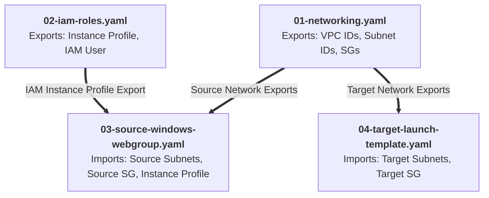

# CloudFormation Templates (CFT) Detailed Architecture Reference

This document provides a comprehensive technical reference for each CloudFormation template in the lab, detailing all resources, input parameters, security configurations, bootstrapping logic, and exported outputs.

---

## 📑 Table of Contents

1. [Module 01: 01-networking.yaml](#1-module-01-01-networkingyaml)
2. [Module 02: 02-iam-roles.yaml](#2-module-02-02-iam-rolesyaml)
3. [Module 03: 03-source-windows-webgroup.yaml](#3-module-03-03-source-windows-webgroupyaml)
4. [Module 04: 04-target-launch-template.yaml](#4-module-04-04-target-launch-templateyaml)
5. [Cross-Stack Dependency & Export Mapping](#5-cross-stack-dependency--export-mapping)

---

## 1. Module 01: `01-networking.yaml`

### 🎯 Purpose
Deploys a **Dual-VPC network topology** that creates two isolated network environments:
- **Source VPC (`10.0.0.0/16`)**: Represents the on-premises datacenter.
- **Target VPC (`10.1.0.0/16`)**: Represents the target AWS cloud destination.

### ⚙️ Parameters
| Parameter | Type | Default | Description |
|---|---|---|---|
| `EnvironmentName` | String | `mgn-lab` | Prefix used for naming and cross-stack exports. |
| `SourceVpcCidr` | String | `10.0.0.0/16` | CIDR block for the simulated on-premise VPC. |
| `SourcePublicSubnet1Cidr` | String | `10.0.1.0/24` | Subnet in AZ 1 for Source Node 01. |
| `SourcePublicSubnet2Cidr` | String | `10.0.2.0/24` | Subnet in AZ 2 for Source Node 02. |
| `TargetVpcCidr` | String | `10.1.0.0/16` | CIDR block for the Target Cloud VPC. |
| `TargetSubnet1Cidr` | String | `10.1.1.0/24` | Subnet in AZ 1 for Target Migrated Node 01. |
| `TargetSubnet2Cidr` | String | `10.1.2.0/24` | Subnet in AZ 2 for Target Migrated Node 02. |

### 📦 Resources Created (20 Resources)

#### A. Source Simulated On-Premises Network
1. **`SourceVPC` (`AWS::EC2::VPC`)**: Isolated VPC with DNS hostnames and resolution enabled.
2. **`SourceInternetGateway` (`AWS::EC2::InternetGateway`)**: Gateway providing outbound/inbound internet routing.
3. **`SourceAttachGateway` (`AWS::EC2::VPCGatewayAttachment`)**: Binds the IGW to `SourceVPC`.
4. **`SourcePublicSubnet1` (`AWS::EC2::Subnet`)**: Public subnet in AZ 0 (`10.0.1.0/24`) with auto-assign public IP enabled.
5. **`SourcePublicSubnet2` (`AWS::EC2::Subnet`)**: Public subnet in AZ 1 (`10.0.2.0/24`) with auto-assign public IP enabled.
6. **`SourcePublicRouteTable` (`AWS::EC2::RouteTable`)**: Routing table for source subnets.
7. **`SourcePublicDefaultRoute` (`AWS::EC2::Route`)**: Directs `0.0.0.0/0` outbound traffic to `SourceInternetGateway`.
8. **`SourceSubnet1RouteTableAssociation` (`AWS::EC2::SubnetRouteTableAssociation`)**: Associates Subnet 1 with route table.
9. **`SourceSubnet2RouteTableAssociation` (`AWS::EC2::SubnetRouteTableAssociation`)**: Associates Subnet 2 with route table.
10. **`SourceWebSecurityGroup` (`AWS::EC2::SecurityGroup`)**:
    - **Port 80 (HTTP)**: Allows incoming web traffic from ALB / clients.
    - **Port 22 (SSH)**: Allows Linux management.
    - **Port 3389 (RDP)**: Allows Windows administration.
    - **Port 443 (HTTPS)**: Enables secure communication with AWS APIs (SSM, ADS, MGN).
    - **Port 1500 (TCP)**: **Critical for MGN** — allows outbound continuous block-level data replication into the AWS MGN Staging Area.

#### B. Target Cloud Network
11. **`TargetVPC` (`AWS::EC2::VPC`)**: Destination VPC for migrated workloads (`10.1.0.0/16`).
12. **`TargetInternetGateway` (`AWS::EC2::InternetGateway`)**: Internet Gateway for target environment.
13. **`TargetAttachGateway` (`AWS::EC2::VPCGatewayAttachment`)**: Attaches IGW to `TargetVPC`.
14. **`TargetSubnet1` (`AWS::EC2::Subnet`)**: Destination Subnet in AZ 0 (`10.1.1.0/24`).
15. **`TargetSubnet2` (`AWS::EC2::Subnet`)**: Destination Subnet in AZ 1 (`10.1.2.0/24`).
16. **`TargetRouteTable` (`AWS::EC2::RouteTable`)**: Route table for target subnets.
17. **`TargetDefaultRoute` (`AWS::EC2::Route`)**: Directs `0.0.0.0/0` traffic to `TargetInternetGateway`.
18. **`TargetSubnet1RouteTableAssociation` (`AWS::EC2::SubnetRouteTableAssociation`)**: Associates Target Subnet 1.
19. **`TargetSubnet2RouteTableAssociation` (`AWS::EC2::SubnetRouteTableAssociation`)**: Associates Target Subnet 2.
20. **`TargetWebSecurityGroup` (`AWS::EC2::SecurityGroup`)**: Security group for target migrated instances (Ports 80, 22, 3389).

---

## 2. Module 02: `02-iam-roles.yaml`

### 🎯 Purpose
Provisions the Identity and Access Management (IAM) roles, instance profiles, and user credentials required for AWS Systems Manager (SSM), AWS Application Discovery Service (ADS), and AWS Application Migration Service (MGN).

### ⚙️ Parameters
| Parameter | Type | Default | Description |
|---|---|---|---|
| `EnvironmentName` | String | `mgn-lab` | Prefix used for naming resources. |

### 📦 Resources Created

1. **`SourceWindowsEC2Role` (`AWS::IAM::Role`)**:
   - **Assumed by**: `ec2.amazonaws.com`.
   - **Attached Managed Policies**:
     - `AmazonSSMManagedInstanceCore`: Enables AWS Systems Manager Session Manager browser access, removing the need for open SSH/RDP ports.
     - `CloudWatchAgentServerPolicy`: Allows metrics and logging telemetry.
   - **Inline Policy (`DiscoveryAndMGNInstallationHelper`)**:
     - Grants Discovery actions (`discovery:StartDataCollectionByAgentIds`, `discovery:DescribeAgents`, `discovery:AssociateConfigurationItemsToApplication`).
     - Grants MGN actions (`mgn:*`) and S3 agent download access.

2. **`SourceWindowsEC2InstanceProfile` (`AWS::IAM::InstanceProfile`)**:
   - Encapsulates `SourceWindowsEC2Role` to attach directly to EC2 instances.

3. **`MigrationAgentInstallerUser` (`AWS::IAM::User`)**:
   - Dedicated service user (`mgn-lab-agent-installer`).
   - Attached with `AWSApplicationMigrationAgentInstallationPolicy`.
   - Grants full Discovery & Migration Hub permissions (`discovery:*`, `mgh:*`) to register agents and query configurations.
   - Used in Step 4 of the lab to generate programmatic Access Keys for agent installation.

---

## 3. Module 03: `03-source-windows-webgroup.yaml`

### 🎯 Purpose
Provisions the **heterogeneous multi-OS source web cluster** simulating a production workload with an Application Load Balancer and health-monitored web nodes.

### ⚙️ Parameters
| Parameter | Type | Default | Description |
|---|---|---|---|
| `EnvironmentName` | String | `mgn-lab` | Resource naming prefix. |
| `WindowsAmiId` | SSM Parameter | `/aws/service/ami-windows-latest/Windows_Server-2022-English-Full-Base` | Dynamically resolves the latest Windows Server 2022 AMI. |
| `LinuxAmiId` | SSM Parameter | `/aws/service/ami-amazon-linux-latest/al2023-ami-kernel-default-x86_64` | Dynamically resolves the latest Amazon Linux 2023 AMI. |
| `WindowsInstanceType` | String | `t3.micro` | Sizing for Windows IIS node (`t2.micro` or `t3.micro` for Free Tier). |
| `LinuxInstanceType` | String | `t3.micro` | Sizing for Linux NGINX node (`t2.micro` or `t3.micro` for Free Tier). |
| `KeyPairName` | String | `""` | (Optional) Key pair for RDP/SSH. |

### 📦 Resources Created

1. **`SourceWebALB` (`AWS::ElasticLoadBalancingV2::LoadBalancer`)**:
   - Internet-facing Application Load Balancer deployed across `SourcePublicSubnet1` and `SourcePublicSubnet2`.
2. **`SourceWebTargetGroup` (`AWS::ElasticLoadBalancingV2::TargetGroup`)**:
   - Protocol: `HTTP :80`.
   - Health check path: `/health.html` (Interval: 15s, Timeout: 5s, Healthy Threshold: 2).
   - Target instances: `WindowsNode1` and `LinuxNode2`.
3. **`SourceWebALBListener` (`AWS::ElasticLoadBalancingV2::Listener`)**:
   - Listens on `HTTP :80` and forwards traffic to `SourceWebTargetGroup`.
4. **`WindowsNode1` (`AWS::EC2::Instance`)**:
   - **OS**: Windows Server 2022 Datacenter.
   - **Instance Type**: `t3.micro` (Free Tier).
   - **Subnet**: `SourcePublicSubnet1`.
   - **Storage**: 60 GB gp3 root volume.
   - **UserData Bootstrapping**:
     - Installs IIS Web Server, ASP.NET 4.5, and management tools via PowerShell.
     - Generates `/health.html` returning `"OK - Node-01 (Windows) - <Hostname>"`.
     - Creates styled blue landing page displaying hostname, node status, and IIS version.
5. **`LinuxNode2` (`AWS::EC2::Instance`)**:
   - **OS**: Amazon Linux 2023 (AL2023).
   - **Instance Type**: `t3.micro` (Free Tier).
   - **Subnet**: `SourcePublicSubnet2`.
   - **Storage**: 20 GB gp3 root volume.
   - **UserData Bootstrapping**:
     - Installs and enables `nginx` and `python3-pip`.
     - Generates `/health.html` returning `"OK - Node-02 (Linux) - <Hostname>"`.
     - Creates styled green landing page displaying hostname, node status, and NGINX version.

---

## 4. Module 04: `04-target-launch-template.yaml`

### 🎯 Purpose
Provisions the **Target Cloud infrastructure** that receives the migrated instances during Cutover:
- Provisions the Target Application Load Balancer.
- Creates the EC2 Launch Template used by AWS MGN to configure migrated instances.

### ⚙️ Parameters
| Parameter | Type | Default | Description |
|---|---|---|---|
| `EnvironmentName` | String | `mgn-lab` | Resource naming prefix. |
| `TargetInstanceType` | String | `t3.micro` | Default instance type for target instances (`t3.micro`/`t2.micro` for Free Tier). |

### 📦 Resources Created

1. **`TargetWebALB` (`AWS::ElasticLoadBalancingV2::LoadBalancer`)**:
   - Internet-facing Application Load Balancer deployed in `TargetSubnet1` and `TargetSubnet2`.
2. **`TargetWebTargetGroup` (`AWS::ElasticLoadBalancingV2::TargetGroup`)**:
   - Protocol: `HTTP :80`.
   - Health check path: `/health.html`.
   - Migrated instances are registered here after cutover launch.
3. **`TargetWebALBListener` (`AWS::ElasticLoadBalancingV2::Listener`)**:
   - Listens on `HTTP :80` and forwards traffic to `TargetWebTargetGroup`.
4. **`TargetLaunchTemplate` (`AWS::EC2::LaunchTemplate`)**:
   - Defines target instance parameters:
     - Instance type: `t3.micro`.
     - Security Groups: `TargetWebSecurityGroup`.
     - Tags: `MigrationStatus=MigratedWithMGN`.

---

## 5. Cross-Stack Dependency & Export Mapping

### Export Table

| Export Name | Exported by | Imported by | Value |
|---|---|---|---|
| `${EnvironmentName}-SourceVpcId` | Module 01 | Module 03 | `SourceVPC` ID |
| `${EnvironmentName}-SourceSubnet1Id` | Module 01 | Module 03 | `SourcePublicSubnet1` ID |
| `${EnvironmentName}-SourceSubnet2Id` | Module 01 | Module 03 | `SourcePublicSubnet2` ID |
| `${EnvironmentName}-SourceWebSecurityGroupId` | Module 01 | Module 03 | `SourceWebSecurityGroup` ID |
| `${EnvironmentName}-TargetVpcId` | Module 01 | Module 04 | `TargetVPC` ID |
| `${EnvironmentName}-TargetSubnet1Id` | Module 01 | Module 04 | `TargetSubnet1` ID |
| `${EnvironmentName}-TargetSubnet2Id` | Module 01 | Module 04 | `TargetSubnet2` ID |
| `${EnvironmentName}-TargetWebSecurityGroupId` | Module 01 | Module 04 | `TargetWebSecurityGroup` ID |
| `${EnvironmentName}-SourceWindowsInstanceProfileName` | Module 02 | Module 03 | Instance Profile Name |
