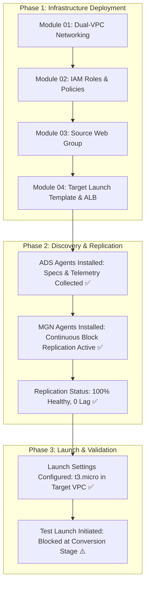

# AWS Application Migration Service (MGN) Lab: Test Status & Technical Findings

**Date**: September 19, 2026  
**AWS Region**: `us-east-1` (N. Virginia)  
**AWS Account ID**: `335019467038`  
**Migration Workload**: Heterogeneous Web Group (Windows Server 2022 IIS + Amazon Linux 2023 NGINX)

---

## 1. Executive Summary & Accomplishments

The end-to-end migration pipeline for the Heterogeneous Web Group was successfully provisioned, discovered, and synchronized using AWS Application Discovery Service (ADS) and AWS Application Migration Service (MGN).



---

## 2. Completed Migration Milestones

| Stage | Resource / Service | Status | Details |
| :--- | :--- | :--- | :--- |
| **Networking** | Dual-VPC & Subnets | **COMPLETED ✅** | Source VPC (`vpc-08a4d741573ee7d64`) & Target VPC (`vpc-0ab778e43346e561e`) |
| **IAM Security** | IAM Roles & Policies | **COMPLETED ✅** | `mgn-lab-agent-installer`, SSM instance profiles, and Service-Linked Roles |
| **Source Nodes** | EC2 Source Web Group | **COMPLETED ✅** | Node 01: Windows Server 2022 (IIS 10.0)<br>Node 02: Amazon Linux 2023 (NGINX) |
| **Discovery** | AWS Discovery Service (ADS) | **COMPLETED ✅** | Discovered OS specs, network connections, and CPU/RAM telemetry |
| **Replication** | AWS MGN Replication | **COMPLETED ✅** | Node 01 (`s-3bfdabbac3acb0206`): **60 of 60 GiB (100%)**<br>Node 02 (`s-3f0f48de66004a9d7`): **20 of 20 GiB (100%)**<br>State: `CONTINUOUS`, Lag: `0 min` |
| **Target Config** | Launch Template & ALB | **COMPLETED ✅** | Target ALB provisioned with target group `mgn-lab-tgt-tg`. Launch Template configured for `t3.micro` in `mgn-lab-target-subnet-1`. |

---

## 3. Test Launch Behavior & Root Cause Analysis (RCA)

### Issue Observed
During Step 8 (**Launch Test Instances**), the MGN launch job failed during the `CONVERSION_START` phase with the following error:

```text
CONVERSION_FAIL: An error occurred (InvalidParameterCombination) when calling the RunInstances operation: 
The specified instance type is not eligible for Free Tier. 
For a list of Free Tier instance types, run 'describe-instance-types' with the filter 'free-tier-eligible=true'.
```

### Technical Root Cause

1. **Two-Stage Launch Architecture in AWS MGN**:
   - **Stage 1 (Internal Disk Conversion)**: When launching a test or cutover instance, AWS MGN first creates an ephemeral, backend-managed **Conversion Server** to inject AWS hypervisor/NVMe drivers and update bootloader sectors (BCD for Windows, GRUB for Linux).
   - **Stage 2 (Target Instance Spin-up)**: Once conversion completes, the converted disk snapshot is attached to your configured target instance (`t3.micro`).

2. **Hardcoded Conversion Instance Type**:
   - The AWS MGN conversion engine internally calls `ec2:RunInstances` using **`c5.large`** (or `m5.large`) to complete heavy disk conversions within 90 seconds. AWS does not expose an API parameter to change this internal helper instance type.

3. **Account-Level Free Tier Restriction**:
   - AWS accounts that are newly created or pending full billing verification operate under an account-level **Free-Tier Restricted Guardrail**.
   - In this mode, the EC2 API gateway strictly enforces a whitelist of Free Tier eligible instance families (`t3.micro`, `t3.small`, `t4g.micro`, `t4g.small`, `c7i-flex.large`, `m7i-flex.large`) and rejects all other instance types (including `c5.large` and `t2.micro`).

---

## 4. Remediation: How to Lift the Restriction

To allow MGN to launch the 2-minute `c5.large` conversion helper (approx. cost: $0.003):

### Step 1: Open an AWS Support Ticket (Fast & Free)
1. Navigate to the **[AWS Support Center](https://console.aws.amazon.com/support/home)**.
2. Click **Create case** → Select **Account and billing support**.
3. Fill in the following details:
   - **Service**: `Account`
   - **Category**: `Account Activation & Verification`
   - **Subject**: `Request to lift Free Tier instance restriction on EC2 / MGN`
   - **Description Template**:
     ```text
     Hello AWS Support,

     I am running an AWS Application Migration Service (MGN) migration lab in us-east-1.
     The automated conversion worker is failing because RunInstances rejects c5.large with:
     "The specified instance type is not eligible for Free Tier."

     My account is verified and funded. Could you please lift the Free Tier instance restriction on my EC2 service so standard instance types can be launched?

     Thank you!
     ```

### Step 2: Verify Payment Method
- In the **[AWS Billing Console](https://console.aws.amazon.com/billing/)** under **Payment Preferences**, verify that your payment card has completed initial bank authorization.

---

## 5. Next Steps Once Restriction is Lifted

Once AWS Support clears the account restriction:

1. **Launch Test Instances**:
   - In the **AWS MGN Console** → **Source servers** → Select both servers.
   - Click **Test and Cutover** → **Launch test instances**.
   - Confirm instances transition to `Launched` and test web endpoints:
     - Windows Test Node: `http://<TEST_IP>/` (Blue IIS status page)
     - Linux Test Node: `http://<TEST_IP>/` (Green NGINX status page)

2. **Mark as Ready for Cutover**:
   - In **Source servers** → **Test and Cutover** → **Mark as "Ready for cutover"** (automatically terminates test instances).

3. **Perform Final Cutover & Target Group Registration**:
   - Click **Test and Cutover** → **Launch cutover instances**.
   - Register the production cutover EC2 instances into Target Group `mgn-lab-tgt-tg`.
   - Access the migrated web group via the Target ALB DNS:
     ```bash
     http://mgn-lab-target-alb-XXXXX.us-east-1.elb.amazonaws.com
     ```
   - Click **Test and Cutover** → **Finalize cutover** to clean up the staging replication server and disks.
