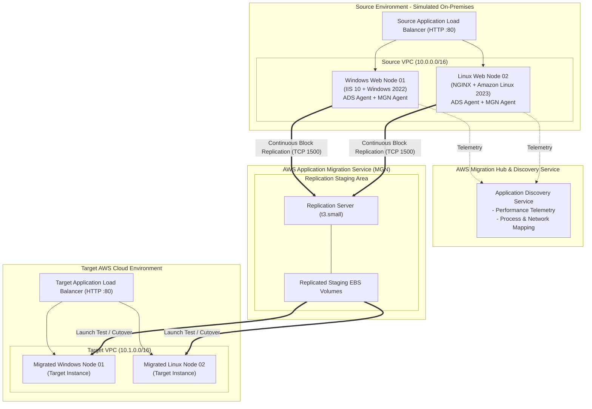

# AWS Application Migration Service (MGN) & Discovery Service Hands-On Lab

An end-to-end hands-on laboratory project designed to simulate an **On-Premises Multi-OS Web Group (1x Windows Server 2022 IIS + 1x Amazon Linux 2023 NGINX)** and perform a complete migration into an **AWS Cloud Target Environment** using **AWS Application Discovery Service (ADS)** and **AWS Application Migration Service (MGN)**.

---

## Architecture Overview



---

## Repository Structure

```
.
├── README.md                              # This document: Architecture & summary
├── LAB_GUIDE_STEP_BY_STEP.md              # Detailed step-by-step tutorial guide
├── cft/                                   # Modular CloudFormation Templates
│   ├── 01-networking.yaml                 # Dual-VPC setup (Source & Target VPCs, subnets, SGs)
│   ├── 02-iam-roles.yaml                  # IAM roles, policies & agent installer user
│   ├── 03-source-windows-webgroup.yaml    # 1x Windows 2022 IIS + 1x Linux 2023 NGINX + ALB
│   └── 04-target-launch-template.yaml     # Target ALB & Target Launch Template
└── scripts/                               # Automation & Testing Scripts
    ├── setup-iis-webgroup.ps1             # Local Windows IIS & web app configuration
    ├── setup-linux-webnode.sh             # Local Linux NGINX & web app configuration
    ├── install-discovery-agent.ps1        # AWS Discovery Agent (Windows) installer
    ├── install-discovery-agent.sh         # AWS Discovery Agent (Linux) installer
    ├── install-mgn-agent.ps1              # AWS MGN Replication Agent (Windows) installer
    ├── install-mgn-agent.sh               # AWS MGN Replication Agent (Linux) installer
    └── verify-migration.ps1               # Pre & Post migration validation suite
```

---

## Lab Workflow Summary

| Phase | Action | Description |
|---|---|---|
| **Phase 1** | **Infrastructure Provisioning** | Deploy CFT modules 01 through 04 to create the dual-VPC architecture, IAM roles, source heterogeneous web group (Windows + Linux), and target load balancer. |
| **Phase 2** | **Application Discovery** | Install the AWS Application Discovery Agent on both Windows and Linux to discover system performance and group servers in Migration Hub. |
| **Phase 3** | **Continuous Data Replication** | Install the AWS Application Migration Service (MGN) agent on both Windows and Linux nodes to initiate continuous block-level sync. |
| **Phase 4** | **Test Launch & Validation** | Launch Test Instances in the Target VPC and verify IIS and NGINX application integrity. |
| **Phase 5** | **Cutover Migration** | Finalize replication, perform Cutover launch, register instances to the Target ALB, and mark migration complete. |
| **Phase 6** | **Cleanup** | Delete CloudFormation stacks and archive MGN source servers to eliminate ongoing costs. |

---

## Quick Start (Deploying CloudFormation Stacks)

Run the following commands using the AWS CLI or deploy directly in the AWS CloudFormation Console:

### Step 1: Deploy Networking (Dual-VPC)
```bash
aws cloudformation create-stack \
  --stack-name mgn-lab-01-networking \
  --template-body file://cft/01-networking.yaml
```

### Step 2: Deploy IAM Roles & Agent Installer User
```bash
aws cloudformation create-stack \
  --stack-name mgn-lab-02-iam \
  --template-body file://cft/02-iam-roles.yaml \
  --capabilities CAPABILITY_NAMED_IAM
```

### Step 3: Deploy Source Web Group (1x Windows + 1x Linux)
```bash
aws cloudformation create-stack \
  --stack-name mgn-lab-03-source-webgroup \
  --template-body file://cft/03-source-windows-webgroup.yaml
```

### Step 4: Deploy Target Environment Resources
```bash
aws cloudformation create-stack \
  --stack-name mgn-lab-04-target \
  --template-body file://cft/04-target-launch-template.yaml
```

---

## Next Steps

Follow the detailed instructions in **[LAB_GUIDE_STEP_BY_STEP.md](file:///c:/Users/imash/OneDrive/Documents/mgn-migration-test/LAB_GUIDE_STEP_BY_STEP.md)** to execute the entire exercise.
